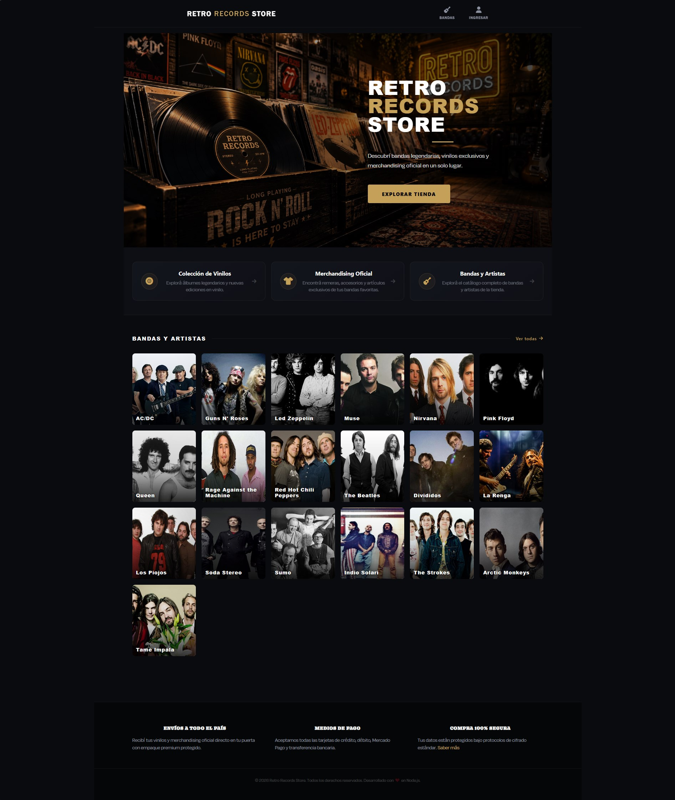
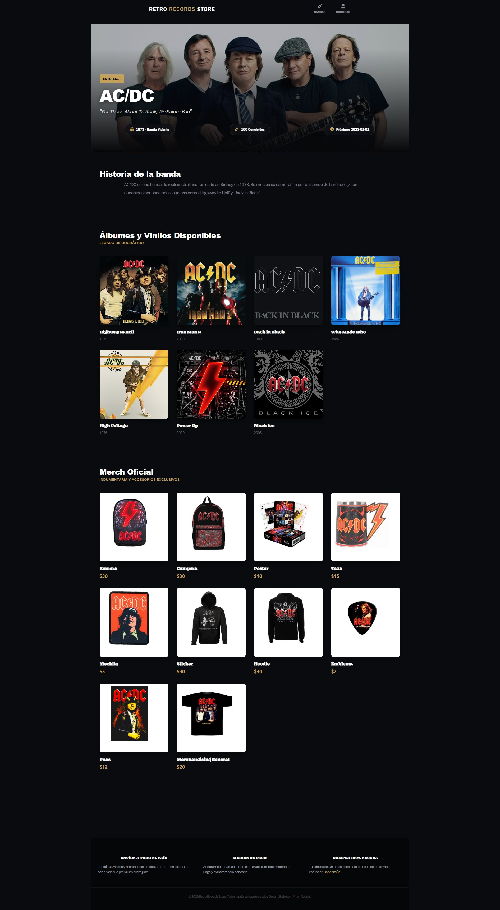
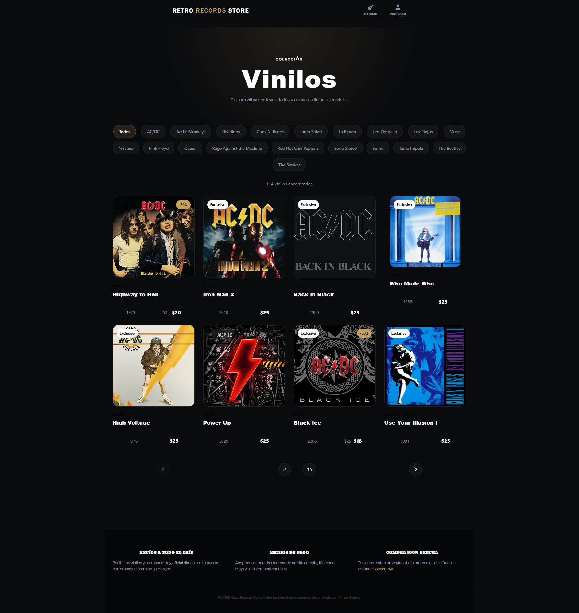
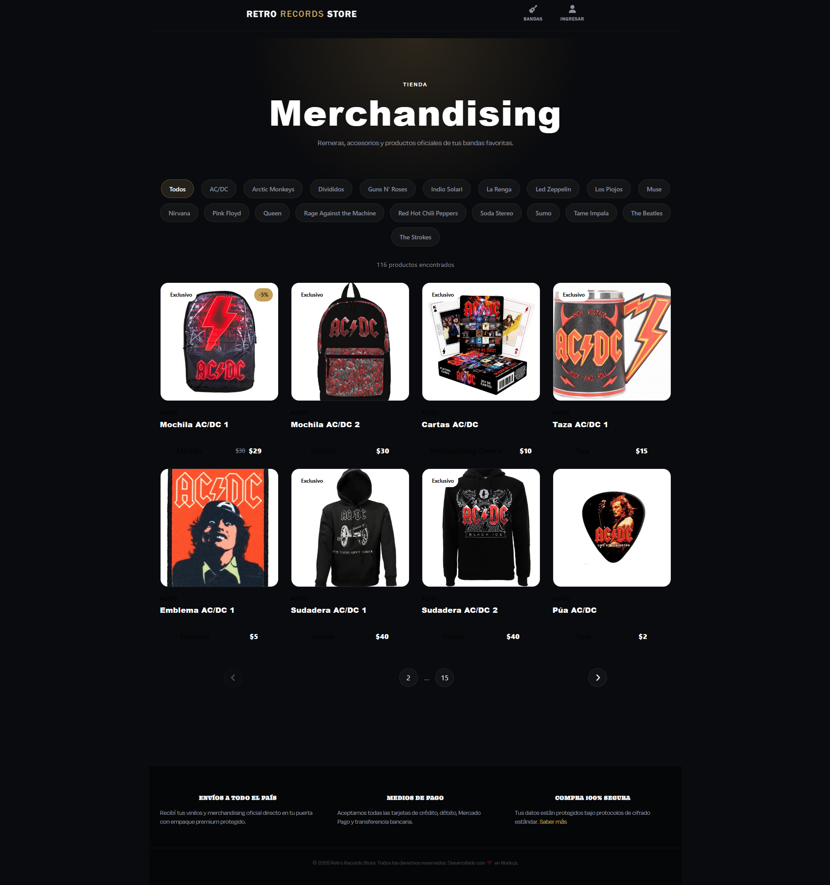
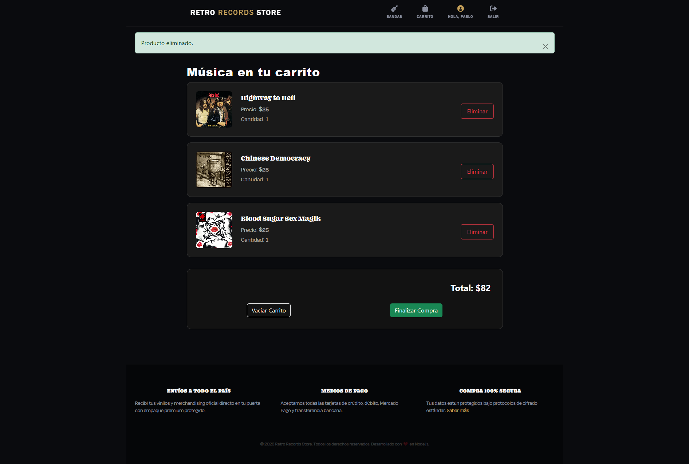
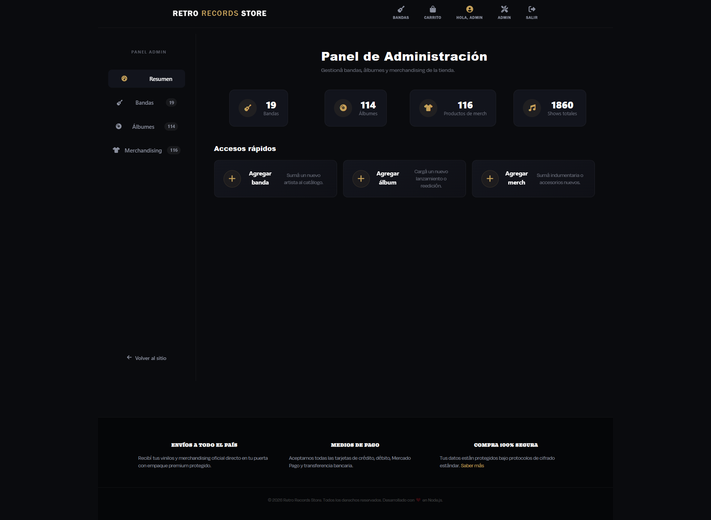
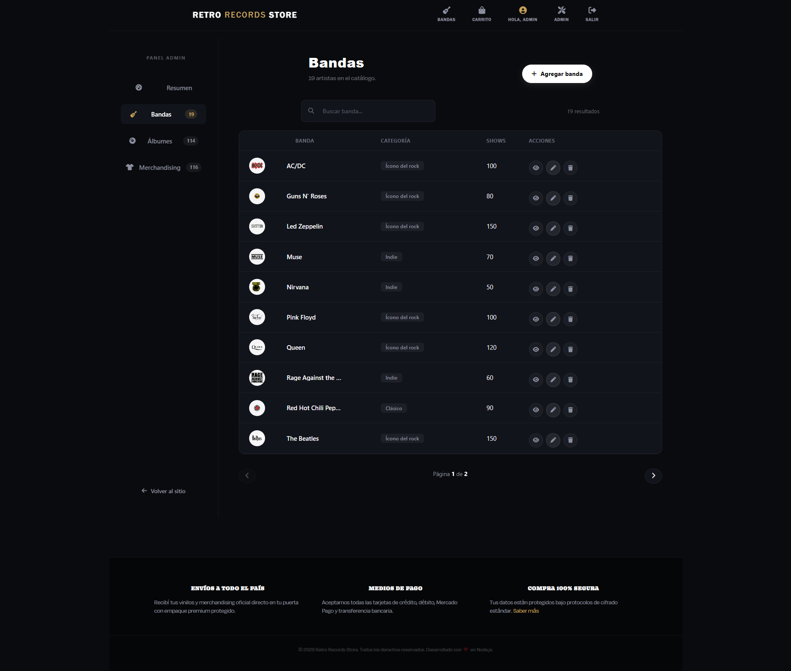

# 🎸 Retro Records Store

<div align="center">


### Ecommerce Full Stack especializado en música, vinilos y merchandising

Explora artistas legendarios, descubre álbumes icónicos y adquiere merchandising oficial en una experiencia moderna inspirada en las grandes tiendas de discos.

</div>

---

## 🚀 Demo

### Sitio Web
[Agregar URL de Deploy]

### Repositorio
[Agregar URL de GitHub]

---

# 📸 Capturas

## Home



---

## Detalle de Artista



---

## Catálogo de Álbumes



---

## Catálogo de Merchandising



---

## Carrito de Compras



---

## Dashboard Administrativo



---

## CRUD de Productos



---

# 📖 Descripción

Retro Records Store es una aplicación web Full Stack desarrollada para simular una tienda online especializada en música.

El proyecto permite a los usuarios explorar bandas, álbumes y productos de merchandising mientras ofrece una experiencia de compra completa con autenticación, carrito y administración del catálogo.

Además incorpora un panel de administración privado desde el cual es posible gestionar completamente el contenido de la tienda.

---

# ✨ Funcionalidades

## 👤 Usuarios

- Registro de usuarios
- Inicio de sesión
- Login con Google OAuth
- Gestión de sesiones
- Perfil de usuario
- Edición de perfil
- Cierre de sesión seguro

---

## 🛒 Ecommerce

- Catálogo de artistas
- Catálogo de álbumes
- Catálogo de merchandising
- Filtros por categorías
- Detalle de productos
- Carrito de compras
- Cálculo automático de totales
- Productos destacados
- Productos exclusivos

---

## 🎵 Artistas

- Listado completo de bandas
- Vista detallada de cada artista
- Información histórica
- Próximos conciertos
- Discografía relacionada

---

## 🔐 Administración

Panel privado para administradores:

### Gestión de Bandas

- Crear bandas
- Editar bandas
- Eliminar bandas

### Gestión de Álbumes

- Crear álbumes
- Editar álbumes
- Eliminar álbumes

### Gestión de Merchandising

- Crear productos
- Editar productos
- Eliminar productos

### Gestión de Imágenes

- Subida de archivos mediante Multer
- Vista previa de imágenes
- Validaciones de formato

---

# 🧰 Tecnologías Utilizadas

## Backend

- Node.js
- Express.js
- Sequelize ORM
- MySQL
- Passport.js
- Google OAuth
- Express Validator
- Multer
- Express Session
- Cookie Parser

---

## Frontend

- EJS
- Bootstrap 5
- CSS3
- JavaScript ES6+
- AOS Animations
- SweetAlert2

---

## Herramientas

- Git
- GitHub
- Postman
- MySQL Workbench
- Figma (Diseño UI)

---

# 🏗️ Arquitectura

El proyecto sigue una arquitectura MVC:

```text
src
│
├── controllers
├── models
├── routes
├── middlewares
├── validations
├── services
├── database
├── public
└── views
```

---

# 🗄️ Base de Datos

La base de datos fue modelada utilizando MySQL y Sequelize.

Principales entidades:

```text
Users
│
├── Cart
├── Orders
└── OrderDetails

Bands
│
├── Albums
└── Merchs

Genres
Categories
Types
```

### Diagrama Entidad Relación


---

# 🔐 Seguridad y Validaciones

El proyecto incorpora múltiples capas de validación:

### Backend

- Express Validator
- Middleware de autenticación
- Middleware de autorización
- Validación de archivos
- Protección de rutas privadas

### Frontend

- Validaciones en formularios
- Feedback visual de errores
- Prevención de envíos inválidos

---

# 📂 Instalación Local

## 1. Clonar repositorio

```bash
git clone https://github.com/tuusuario/retro-records-store.git
```

## 2. Entrar al proyecto

```bash
cd retro-records-store
```

## 3. Instalar dependencias

```bash
npm install
```

## 4. Crear variables de entorno

Crear un archivo:

```env
.env
```

Ejemplo:

```env
DB_HOST=localhost
DB_USER=root
DB_PASSWORD=tu_password
DB_NAME=retro_records_store

GOOGLE_CLIENT_ID=
GOOGLE_CLIENT_SECRET=

SESSION_SECRET=
```

---

## 5. Crear base de datos

```bash
npm run db:creates
```

---

## 6. Ejecutar servidor

```bash
npm run dev
```

Servidor disponible en:

```text
http://localhost:3000
```

---

# 📜 Scripts Disponibles

### Desarrollo

```bash
npm run dev
```

---

### Producción

```bash
npm start
```

---

### Crear Base de Datos

```bash
npm run db:creates
```

---

### Resetear Base de Datos

```bash
npm run db:resets
```

---

# 📈 Desafíos Técnicos Resueltos

Durante el desarrollo se implementaron soluciones para:

- Relaciones complejas con Sequelize
- Gestión de sesiones persistentes
- Login Social con Google
- Middleware de autorización por roles
- Subida y almacenamiento de imágenes
- CRUD completo de múltiples entidades
- Renderizado dinámico con EJS
- Arquitectura MVC escalable

---

# 🎯 Objetivo del Proyecto

Este proyecto fue desarrollado como pieza principal de portfolio para demostrar conocimientos en:

- Desarrollo Backend con Node.js
- Arquitectura MVC
- Bases de datos relacionales
- Autenticación y autorización
- Desarrollo Full Stack
- Buenas prácticas de organización de código
- Construcción de aplicaciones web reales

---

# 📌 Estado Actual

### Activo y en evolución

Actualmente el proyecto continúa recibiendo mejoras visuales y optimizaciones de experiencia de usuario.

Recientemente se eliminó un módulo experimental desarrollado en React que consumía la API de Spotify debido a cambios en las restricciones de acceso de dicha API. La aplicación mantiene su enfoque principal como ecommerce Full Stack basado en Express y EJS.

---

# 👨‍💻 Autor

### Pablo Mas

Desarrollador Full Stack JavaScript

- LinkedIn: [https://www.linkedin.com/in/fullstackdeveloper-pablomas/]
- GitHub: [https://github.com/PabloMas060]
- Portfolio: [Proximamente]

---

<div align="center">


Retro Records Store © 2025

</div>